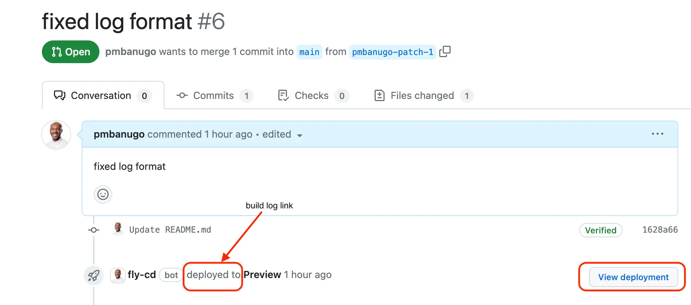
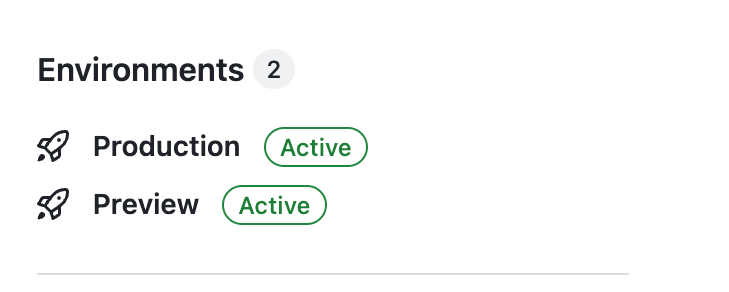
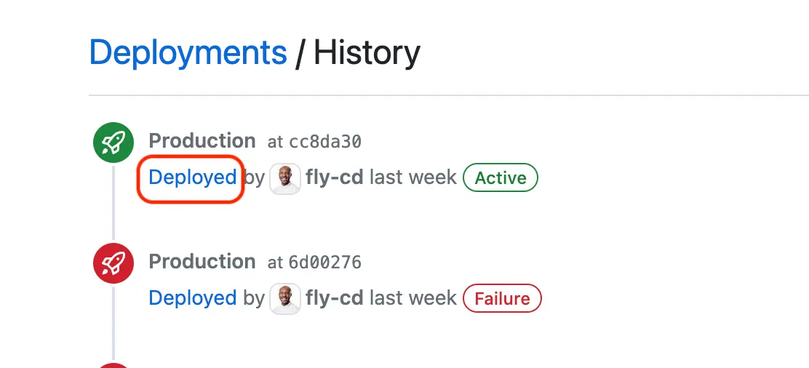

Deployment logs allow you to see the output of building and deploying your code on our CI servers. There’s currently no button to easily get them from the Console UI, but you can alternatively use the link next to the GitHub deployment info for a commit.

## Deployment Log URL

When a commit in a pull request is deployed, you get a link that points to the deployed preview app, and another link to the build logs.

You can also get the same detail from the GitHub deployment history page. To do that:

1. Go to the GitHub repository and click the link to the environment you want to see.

2. Click the **deploy** link for the deployment you want to see the log. You should be taken to the build logs page.

