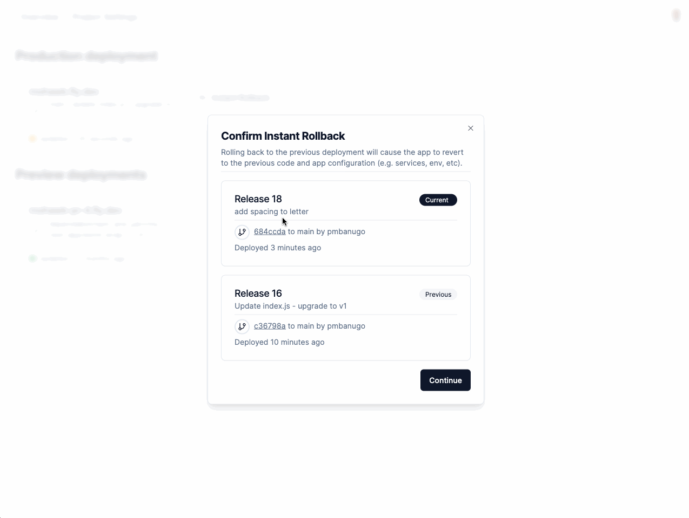
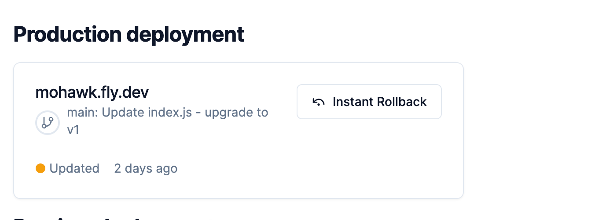
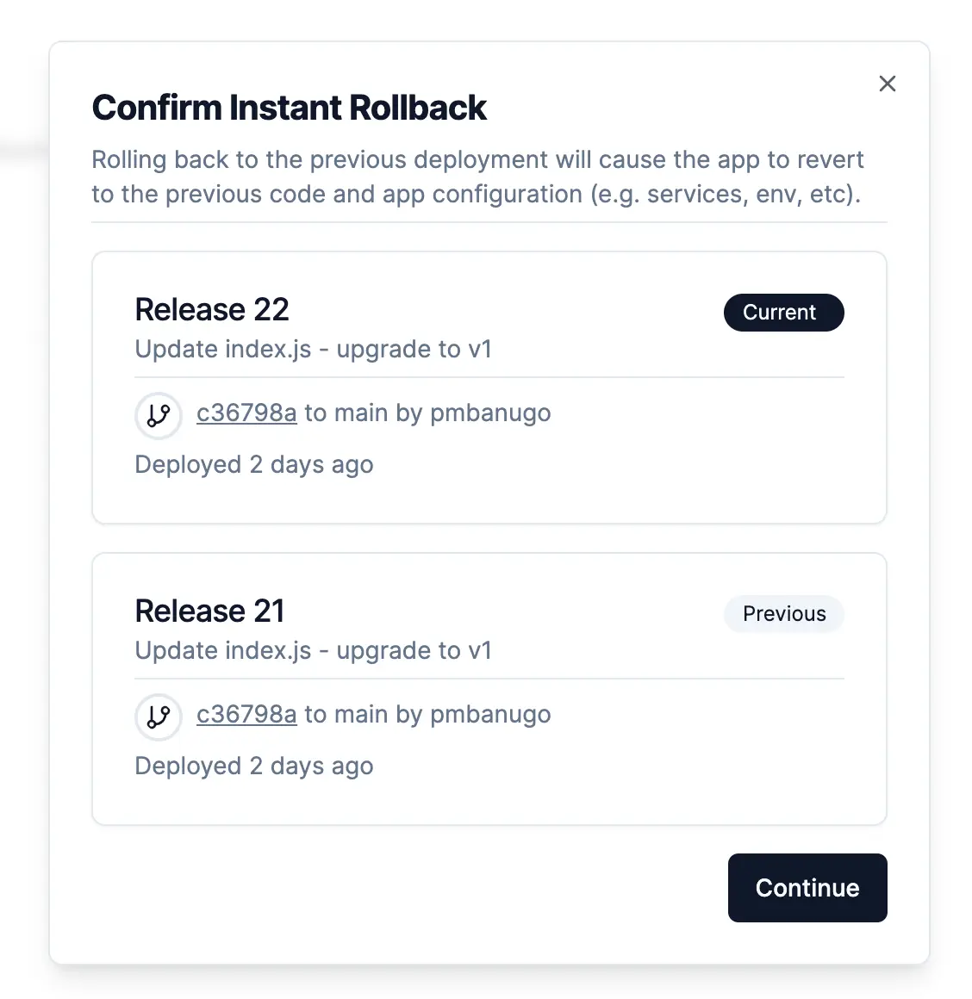

Instant Rollback is a way to quickly revert to a previous production release. This can be useful in situations that require a swift recovery from production incidents, like breaking changes or bugs.

Instant Rollback in action

The rolled-back changes include the code, your app’s environment variables and the configuration used for the previous release. This gives you a complete rollback of app configuration and code, instead of just reverting code like some other platforms do.

## How To Perform Instant Rollback

To initiate an instant rollback:

1. Go to the project’s detail page by clicking on the project on the dashboard home page. You’ll find the **Instant Rollback** button on the project detail page.

2. Click the **Instant Rollback** button. This should bring up a confirmation dialog with details about the release and a button to confirm you want to roll back. You can see information about the commit associated to the release, when it was deployed, and other information.

3. Click the **Continue** button if you want to proceed. This will trigger an instant rollback event and update the [GitHub deployment](deployment-log.md) status as it progresses.

:::note
This feature is only available to [premium](pricing.md) users. If you’re on the free plan, the button will be disabled and FlyCD won’t collect information to enable it to perform instant rollback for that project.
Check out the [pricing page](pricing.md) for information on how to subscribe to the premium plan.
:::