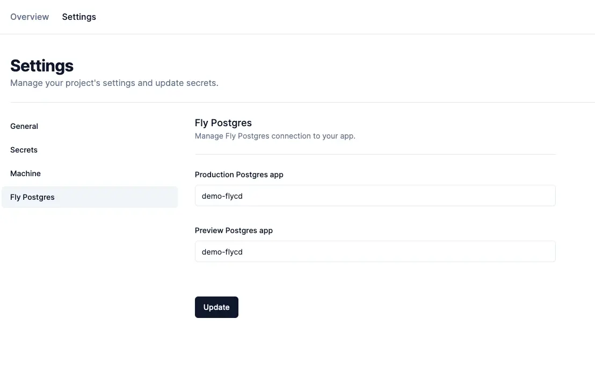

There are cases you want to connect a project to a Postgres database hosted on Fly. FlyCD can help manage this integration by making sure the production and preview apps are attached to a specific Fly Postgres app/cluster.

## How does this work?

This integration works by attaching the Postgres database to your project. This is equivalent to running `fly postgres attach` from your terminal. It automatically provides the `DATABASE_URL` as an environment variable for your app to use to connect to the Postgres cluster.

Each preview app will get a unique `DATABASE_URL` when they’re first created. Production apps get just the same `DATABASE_URL` for every update/deployment.

## How to connect a FlyCD project to a Fly Postgres instance

First ensure you have created the Fly Postgres cluster, then follow the steps below:

1. Go to your [FlyCD dashboard](https://flycd.dev/dashboard).
2. Click on the project you want to add integration for Fly Postgres. This should take you to the project’s info page.
3. Click **Settings** at the top navigation, and you’ll be taking to the project’s settings page.
4. Click **Fly Postgres** on the left side navigation, and you’ll be shown the **Fly Postgres** settings page.

5. Now enter the name of the Fly Postgres app you want to attach to the project.
6. Then click the **Update** button to save your changes.

Once the changes are saved, new deployments for the project will use the new settings/configuration.

The production and preview Postgres app can be the same. Ideally, you’d want to have a development cluster and a separate production cluster. Use the development cluster for all your preview deployment.