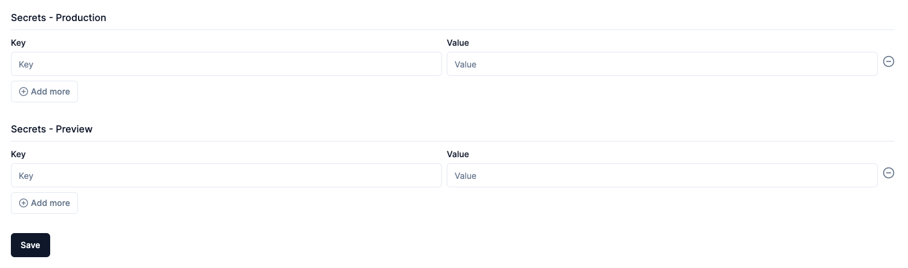

There are two types of secrets your project could make use of:

1. **App Secrets**: These are encrypted key/value pairs that your application can access at runtime.
2. **Build secrets**: These are encrypted values that are available only when the app is being built.

## App Secrets

As shown in the image below, you can add application secrets when creating a new project.

Application secret when creating a new app

You can use different secrets for your production and preview apps. The preview app secrets are used only for the preview apps, while the production secrets are used for production apps.

### Add & Update App Secrets For Existing Projects

You can add or modify secrets for existing apps through the project’s settings page. You can get to this page from the project’s detail page by clicking on the **Project Settings** link at the top navigation, and then clicking the **Secrets** link on the left side navigation.

A project’s secrets settings page

You can add new secrets for production or preview apps via the **Secrets** settings page.

You also see the list of secrets for the project, and the configured environment. The secret list below the form only shows the secret key, not the value. The values are only available in the continuous deployment pipeline during application deployment.

There’s no separate form to edit/update secrets at the moment. The same form is used to add new secrets or edit existing ones. To change the value of an existing secret, you can add it through the form using the same key, and the value will be overwritten when it’s saved.

:::note
Updated and newly added secrets will be applied at the next deployment. 
:::

## Build Secrets

Build secrets are a set of key/value pairs that are used when building the project’s source code. This is the same as using `--build-secret` when using `flyctl`.

You can manage these secrets from the project’s **Build** **Settings** page. You can reach this page by clicking the **Build** link from the left navigation pane.

Build Config Page

This page is similar to the app’s Secrets page in terms of how it displays and stores secrets. You can add or overwrite existing secrets using the form on the page.

:::tip
There’s no means to delete secrets at the moment. It’s an issue that’s currently in the backlog.
:::