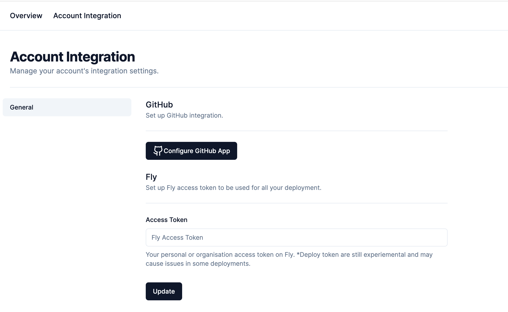
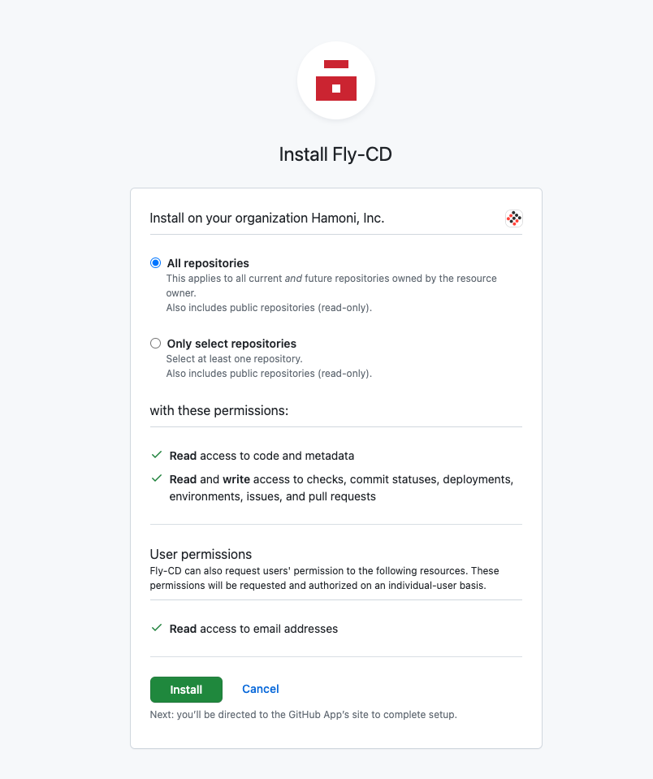
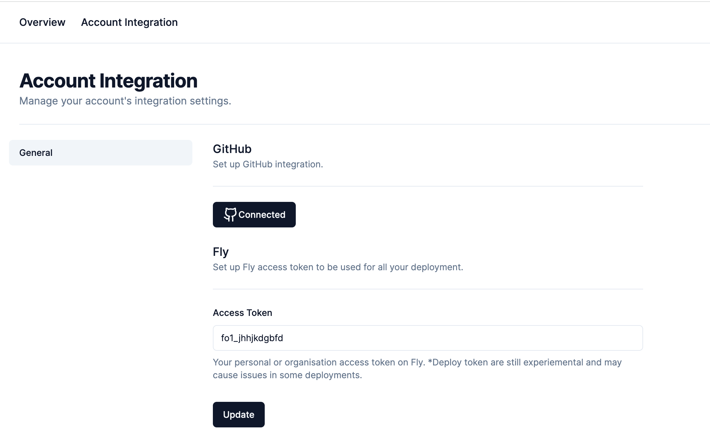
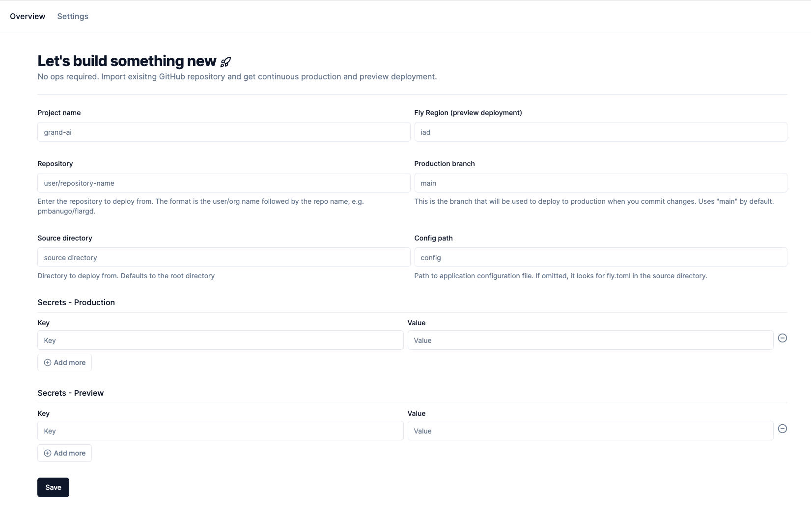

This guide helps new users set up their FlyCD account with GitHub and Fly.io, as well as create their first project.

If you don’t already own a FlyCD account, go to [flycd.dev/login](http://flycd.dev/login) to create a new account. The same page is responsible for sign up and login. Click the button to authenticate using your GitHub account.

After successful authentication from GitHub, your account should be created and you’ll be redirected to the settings page. This is the place you’ll configure the access token used to deploy apps to your Fly account/organisation. You will also need to configure the FlyCD GitHub app, which enables FlyCD to know when commits are made to the selected repositories.

Account Integration Settings Page

Follow the instructions below to set up your Fly Access Token and connect the GitHub app.

## Account Integration Settings

1. Click the **Configure GitHub App\*\*** button. This should take you to a GitHub page where you can choose to install the app to your personal account or organisation you belong to. Pick any of the accounts to install the app.
2. Now you can how you want to install the app. You can either grant access to all your repositories or selected repositories. The permissions you’re granting to the app can be seen on that page as well (we do not require write access to your repository content).
3. Click the **Install** button to install the app. You will be redirected to FlyCD settings page when the process is done.

1. Back on the _Integration Settings_ page, enter your [Fly.io](http://Fly.io) access token in the input field
2. Click the _Update_ button to save the data. You should see a pop up that tell you if it was successfully saved.

Integration settings page - the GitHub app is linked to your GitHub account/organisation

## Set Up A New Project

Now that your Fly access token is configured, and your account linked to GitHub, you can create your first project 🥳

Click the **Overview** link at the top navigation in order to go to the home page. On the home page, click the **New Project** button. You’ll be taking to the **New Project** page.

You’re presented with a form to collect info about the project to create. Enter a unique project name, and follow the info in the form to fill out the remaining details.

:::tip
If you want to configure the Fly Postgres integration, save the project and go to the project settings. There you’ll find more options to configure how the project should be deployed
:::

When you’re done, click the _Save_ button to save the project. Now that the project is saved, you’ll get automatic deployment whenever you push new changes to your production branch, or preview app deployment when you create pull requests.

:::note
Your repository needs to have _fly.toml_ at the source directory path.
:::

Check the rest of the docs to find out things you can do with FlyCD. For example, read about how to view your deployment build logs.
